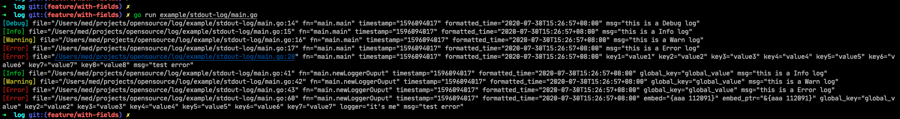
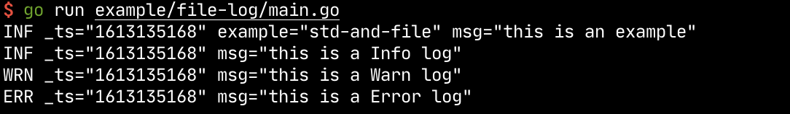

## log

[](https://goreportcard.com/report/github.com/yeqown/log) [](https://pkg.go.dev/github.com/yeqown/log)

a lite golang log library, easy to get start and no dependency.

### Features

[x] `consolt` and `filelog` support 

[x] `WithFields` support

[x] lite and easy to use

### Install 

```sh
go get -u github.com/yeqown/log 
```

### Quick Start

There is sample code of using `log`.

```go
package main

type embed struct {
	FieldA string
	FieldB int
}

func main() {
	// using builtin logger
	log.Info(1, 2, 3, 4, 5)
	log.Infof("this is format: %d", 2)

	log.
		WithField("key1", "value1").
		WithFields(log.Fields{
			"key2": "value2",
			"key3": "value3",
			"key4": "value4",
			"key5": "value5",
			"key6": "value6",
			"key7": "value7",
			"key8": "value8",
		}).Error("test error")

	// using new logger
	logger, _ := log.NewLogger(
		log.WithLevel(log.LevelError),
		log.WithGlobalFields(log.Fields{"global_key": "global_value"}),
	)
	logger.Info(1, 2, 3, 4, 5)
	logger.Infof("this is format: %d", 2)
	logger.WithField("logger", "it's me").
		WithFields(log.Fields{
			"key2": "value2",
			"key3": "value3",
			"key4": "value4",
			"key5": "value5",
			"key6": "value6",
			"key7": "value7",
			"embed": embed{
				FieldA: "aaa",
				FieldB: 112091,
			},
			"embed_ptr": &embed{
				FieldA: "aaa",
				FieldB: 112091,
			},
		}).Error("test error")
    // [Error] file="/Users/yeqown/projects/opensource/log/logger_entry.go" fn="github.com/yeqown/log.(*entry).output" 
    // line="109" timestamp="1596090798" formatted_time="2020-07-30T14:33:18+08:00" embed="{aaa 112091}" 
    // embed_ptr="&{aaa 112091}" global_key="global_value" key2="value2" logger="it's me" msg="test error"
}
```

### Migrate

Here is a broken change from `d68941c` to `v1.x`. `v1.x` is advised to use.

### shots

Here are some shots of using example.

##### 1. stdout shots



##### 2. file shots

> output to stdout and file both.


